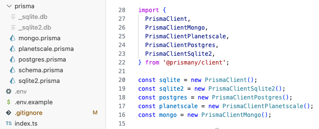

# Prismany

Query any number of databases with Prisma



## Commands

### **Generate**

`npx prismany generate`

- Generates a Prisma client for every schema in your `./prisma` directory

- Clients can be imported via

  ```ts
  import { PrismaClientSchemaName, PrismaClientSchemaName2 } from '@prismany/client';
  ```

  - Eg: `./prisma/myCoolDb.prisma` can be imported from:

  ```ts
  import { PrismaClientMyCoolDb } from '@prismany/client';
  ```

- Note: The `generate` command will add a `"client.output"` path to each of your `.prisma` files

### **Push**

`npx prismany push`

- Runs `prisma db push` against all of your schemas

- If any `push` fails, or requires confirmation, the command will terminate and you'll need to push the individual schema manually: `npx prisma db push --schema=./prisma/myDb.prisma`

### **Other**

If you'd like to see other Prisma features supported, like `migrate`, please [open an issue](https://github.com/JoeRoddy/prismany/issues).

## Client Types

You can access your model types, and ORM input types like so:

```tsx
// prisma client
import { PrismaClientDb1 } from '@prismany/client';
// advanced model, input types
import { Prisma, MyModel } from '@prismany/client/db1';

const db = new PrismaClientSomeDb1();

const createModelInstance = (data: Prisma.MyModelCreateInput): MyModel => db.myModel.create({ data });
```

## How it works

This CLI takes an approach similar to [this wonderful answer](https://github.com/prisma/prisma/issues/2443#issuecomment-630679118) on Prisma's Github. It uses the `client.output` path in your Prisma schema to make sure clients don't overwrite each other.

Prismany automates much of the manual effort involved in that approach, and crucially, reuses the same `engine` binary for all clients.

This brings each client from a minimum of **15MB** down to just **80KB** each.

## Example app

https://github.com/JoeRoddy/prismany-example
